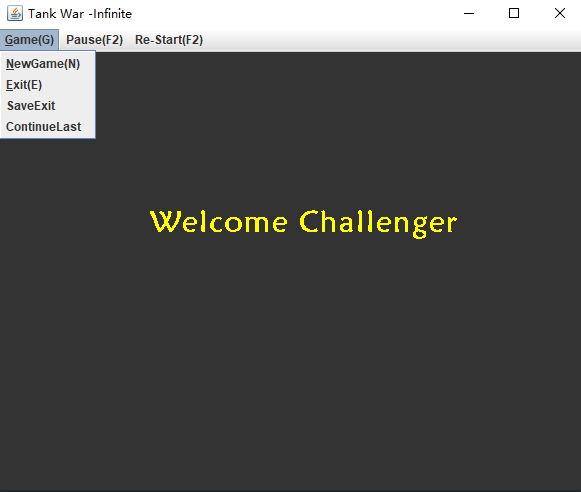
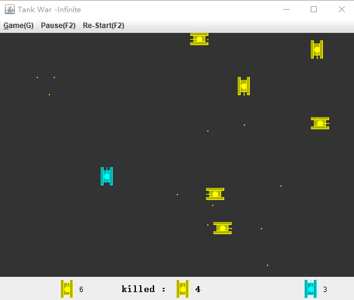

# Tank War
*A classical game developed in JAVA inspired by 韩顺平-坦克大战 . This repository is for display. For any beginner who wants to see the code and  to improve JAVA development skills, contact with me, and I will share it.*
***

## Interface

* **Game(G):**
    * **NewGame(N)**: Start a new game
    * **Exit(E)**: Exit game without save.
    * **SaveExit**: Exit game with save.
    * **ContinueLast**: You can restart the latest game you saved.

* **Pause(F2) & Re-Start(F2)**: Pause and continue game.
****
## Game Display

* **Game:**
     * This is an infinite version game *(enemy tank will reborn.)*.
     * There are explosion animation *(image changed and repaint)* and  
     audioplay *(really loud!!)*
     * Save file only contains latest game player saved *(Not a sql file)*.  

     * **Blue Tank(Player Tank):**
        * **KeyBoard:** WASD for move, WhiteSpace for fire. 
        * **Bullets:** Player tank has a limit size of bullets. 
     
     * **Yellow Tank(Enemy Tank):**
        * **Bullets:** Enemy tanks have less size of bullets.
 
 ***
## Future work
   Currently, tha game has no difficulty settings. I am trying to add more types of  
   enemies and modify difficulty.  
    
## Thanks 
   Thanks to *@小小的香辛料 from CSDN* shared audio and image materials. 

